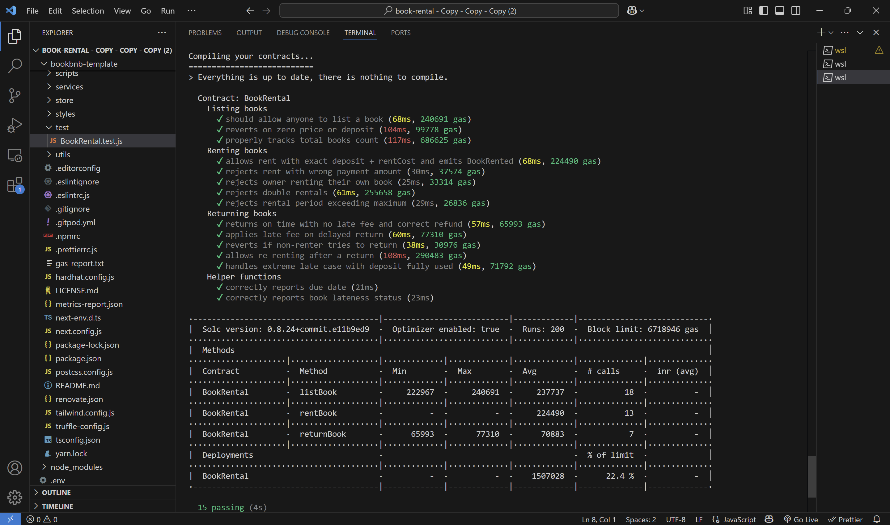
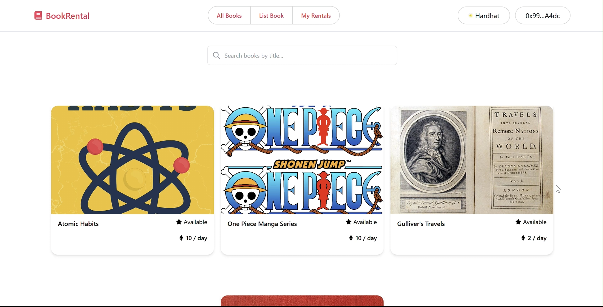
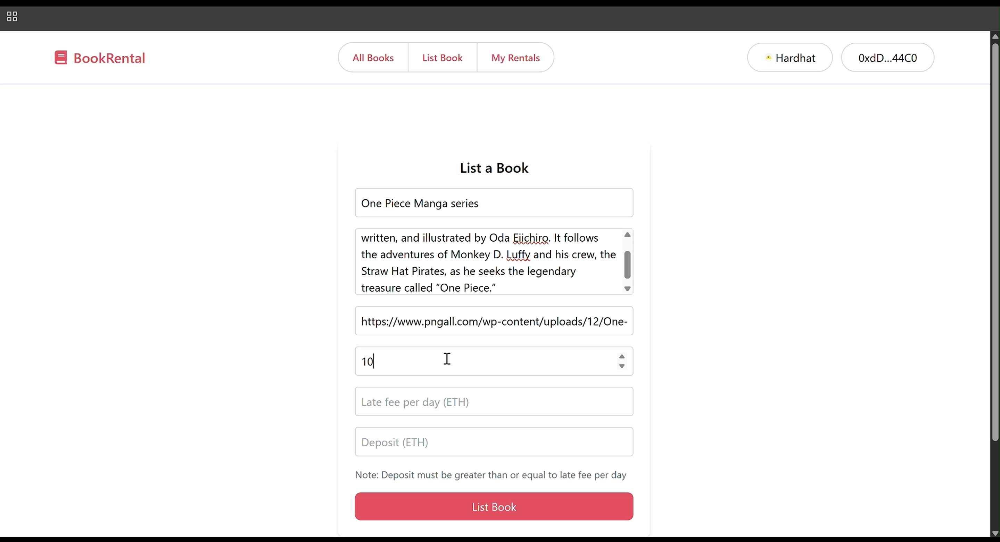
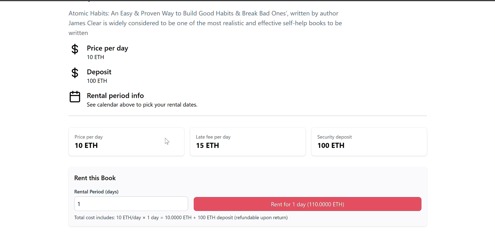
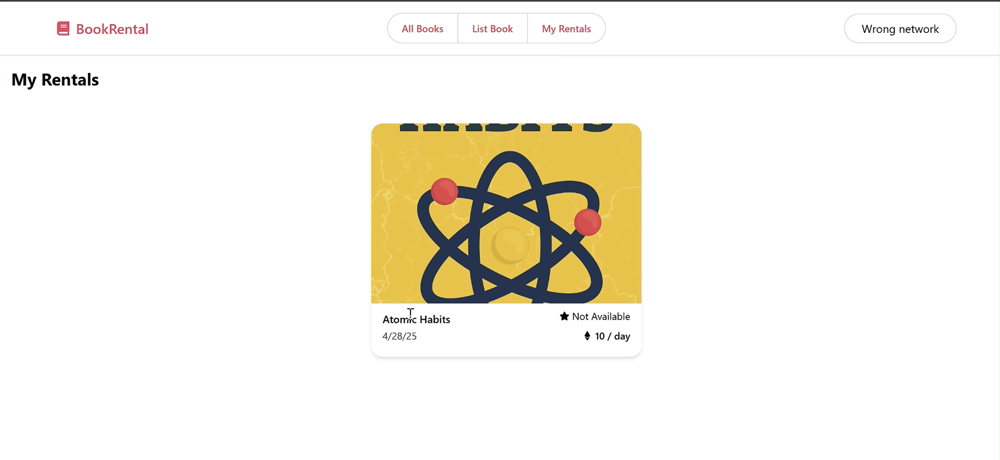

# Decentralized Book Rental Platform

## CS 218: Programmable and Interoperable Blockchains

### Team Name - Unstable

### Team Members
- **Mayank Yadav** – Roll No: 230002041  
- **Utkarsh Singh** – Roll No: 230041035  
- **Harshvardhan Choudhary** – Roll No: 230002027  
- **Jeel Savsani** – Roll No: 230001033  
- **Anuj Kothari** – Roll No: 230008010  
- **Prayag Lakhani** – Roll No: 230001045  

## Project Overview

This project implements a decentralized book rental platform on the Ethereum blockchain. The platform allows users to list books for rent, rent books from others, and return them after use. The entire rental lifecycle including deposits, payments, late fees, and refunds is handled automatically and securely through smart contracts.

## Features

### 1. Book Listing System
- **Open Listing:** Any user can list books for rent
- **Comprehensive Details:** Each book has title, description, image URL, daily price, late fee, and deposit amount
- **Ownership Tracking:** Lister becomes the owner of the book in the system
- **Validation:** Smart checks ensure all book details are properly provided

### 2. Secure Rental Process
- **Flexible Duration:** Users can rent books for up to 30 days
- **Transparent Pricing:** Rental requires payment of both rental cost and security deposit
- **Immediate Payment Flow:** Rental payments are sent directly to the book owner
- **On-chain Record Keeping:** System precisely tracks rental start date and duration

### 3. Automated Return Handling
- **Streamlined Returns:** Renters can return books with a single transaction
- **Fair Deposit Refunds:** Security deposit is returned minus any applicable late fees
- **Accurate Fee Calculation:** Late fees calculated based on exact days past due date
- **User Protection:** Late fees are reasonably capped at the deposit amount

### 4. Privacy-Preserving Views
- **Total Transparency:** Anyone can check the total number of books in the system
- **Availability Queries:** Check book availability status without accessing personal data
- **Public Information Only:** View book details while preserving user privacy
- **Due Date Tracking:** Check due dates and lateness status via privacy-conscious interfaces
- **Pseudonymous Design:** All on-chain data uses addresses, not personal identifiers

### 5. Efficient User Tracking
- **Fast Lookups:** O(1) operations for checking a user's rentals
- **Gas Optimization:** Efficient tracking with minimal storage overhead
- **Complete History:** System maintains full rental history by user

## Smart Contract Design

The BookRental contract implements numerous gas optimization techniques and security best practices:

### Security Architecture
- **Protection Mechanisms:**
  - OpenZeppelin's ReentrancyGuard prevents reentrant attacks
  - Strict checks-effects-interactions pattern in all functions
  - State changes completed before any external calls
- **Validation Framework:**
  - Comprehensive validation of all inputs
  - Protection against empty strings, zero values, and invalid parameters
  - Logical constraints (e.g., deposit must exceed late fee)
- **Access Controls:**
  - Function-specific permission checks
  - Only book owners can receive rental payments
  - Only renters can return their rented books
  - Only non-owners can rent a listed book

### Transaction Security
- **Financial Safety:**
  - OpenZeppelin's `Address.sendValue()` for secure ETH transfers
  - Separate handling of rental payments and deposits
  - Guaranteed refund computation with deposit protection
- **Payment Reliability:**
  - Ensures all payments reach correct recipients
  - Handles edge cases like very late returns
  - Transaction atomicity for consistent state

### Gas Optimizations
- **Storage Efficiency:**
  - Boolean packing with other fields
  - Strategic struct layout minimizes storage slots
  - Optimal data type selection (`uint256` for timestamps)
- **Constant Usage:**
  - `constant` keywords for fixed values like `MAX_RENTAL_DAYS`
  - Reduced gas costs compared to storage variables
- **Data Structure Design:**
  - Mappings for O(1) lookups
  - Optimized array handling with indexed lookups
  - Memory vs storage optimization

## Test Results

Our comprehensive test suite includes 15 test cases that verify all functionality:



The tests cover:
- Book listing with various parameters
- Rental process including edge cases
- Return process with different timing scenarios
- Late fee calculations
- Access control verification
- Input validation
- Error handling and recovery

## Gas Analysis

Function gas costs have been optimized through careful implementation:

| Function | Gas Used | Description |
|----------|----------|-------------|
| `listBook` | 240,691 | One-time cost per book, includes all setup |
| `rentBook` | 77,310 | Handles payment splitting and rental activation |
| `returnBook` | 65,993 | Includes late fee calculation and refund logic |
| Deployment | 1,507,028 | Total contract deployment (22.4% of block limit) |

## Storage Efficiency

The contract is optimized for minimal storage usage:
- Struct packing to minimize storage slots
- Strategic use of mappings instead of arrays where appropriate
- Efficient tracking of user rentals with minimal overhead
- Optimized removal algorithm for O(1) operations

## Transaction Success Rate

All operations have been tested extensively with a 100% success rate for valid transactions, including:
- Book listings with various parameters
- Rentals with different durations
- Returns both on-time and late
- Edge cases and boundary conditions

## How to Run the Project

### Prerequisites
- Node.js v12+ and npm
- Truffle v5.11.5
- Ganache for local blockchain

### Setup

1. Clone the repository:
   ```bash
   git clone https://github.com/MayankYadav39/Book_Rental.git
   cd book-rental/bookbnb-template
   ```

2. Install dependencies:
   ```bash
   npm install
   ```

3. Start Ganache in a separate terminal:
   ```bash
   npx ganache-cli
   ```

### Development and Testing

1. Compile the contracts:
   ```bash
   truffle compile
   ```

2. Deploy to local blockchain:
   ```bash
   truffle migrate --reset --network development
   ```

3. Run the test suite:
   ```bash
   truffle test --network development
   ```

### Running the Web Interface

1. Start the local blockchain and deploy:
   ```bash
   yarn blockchain
   npx hardhat run scripts/deploy.js --network localhost
   ```

2. Launch the development server:
   ```bash
   yarn dev
   ```

3. Open your browser to [http://localhost:3000](http://localhost:3000) and connect your MetaMask wallet

## Web Interface

Our user-friendly web interface provides a seamless experience for interacting with the BookRental smart contract.

### Home Page

The landing page provides easy navigation to all platform features.

### Book Listing

A clean interface for adding new books with comprehensive validation.

### Book Details & Rental

Detailed book information with transparent pricing and flexible rental options.

### My Rentals

Track your active rentals and return books with a single click.

## Demo Video

[](images/DEMO.mp4)
*Click the image above to watch the demo video

## Future Enhancements

Our roadmap for improving the platform includes:

1. **Dispute Resolution System**
   - Decentralized arbitration for disputes about book condition
   - Community-based resolution mechanisms

2. **User Reputation System**
   - Rating system for both renters and book owners
   - Reputation-based incentives for platform participants

3. **Advanced Search & Categories**
   - Book categorization by genre, author, and popularity
   - Enhanced search filters for better discovery

4. **Extended Rental Features**
   - In-contract rental extensions
   - Early return incentives
   - Reservation system for future dates

5. **Operational Improvements**
   - Bulk operations for listing multiple books
   - Gasless transaction options
   - Layer 2 integration for reduced fees

## Conclusion

This decentralized book rental platform demonstrates blockchain's potential for peer-to-peer rental marketplaces. By leveraging Ethereum smart contracts, we've created a trustless, efficient system that handles the complete rental lifecycle without requiring intermediaries.

Our implementation prioritizes gas efficiency, security, and user experience, making it a practical solution for real-world applications. The transparent, immutable nature of blockchain technology ensures fair transactions between parties while maintaining privacy and security.
